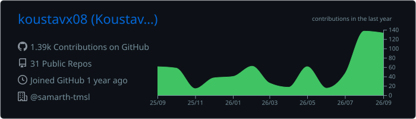
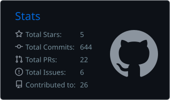
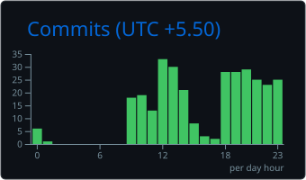
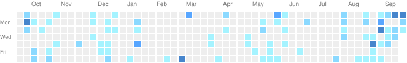

<div align="center">

```
> koustavx08 --profile
```

# `koustav singh`

**full stack developer** &nbsp;·&nbsp; **web3 developer** &nbsp;·&nbsp; **btech** &nbsp;·&nbsp; **india**

[](https://koustavx08.runs-on.dev)
[](https://www.linkedin.com/in/koustavx08)
[](https://x.com/koustavx08)
[](https://koustavx08.hashnode.dev)
[](https://discord.com/users/1214583767562457168)
[](mailto:koustavsinghcollege@gmail.com)


</div>

---

## `~/whoami`

```ts
const koustav = {
  location: "India 🇮🇳",
  education: "BTech",
  focus: ["full stack", "web3"],
  building: ["dapps", "smart contracts", "web apps"],
  chains: ["ethereum", "solana", "avalanche"],
  learning: ["system design", "protocol design", "agentic AI"],
  motto: "code with passion, debug with patience",
};
```

- shipping full stack apps end to end, browser to database
- writing and testing smart contracts, wiring them to real frontends
- connecting web2 UX with web3 rails so onboarding does not hurt
- digging into system design, microservices and protocol internals

---

## `~/stack`

**web3**


**frontend**


**backend**


**data & cloud**


**tooling**


**also**


---

## `~/learning`

```
> smart contract security & gas optimization
> protocol / system design at scale
> agentic AI and automation (n8n, LangGraph)
```

---

## `~/activity`

<div align="center">



<table>
<tr>
<td width="50%" align="center">



</td>
<td width="50%" align="center">



</td>
</tr>
</table>


<br/><br/>



</div>

---

## `~/offline`

```
music  ·  games  ·  tech blogging  ·  content creation
```

---

<div align="center">

<sub>

[](https://buymeacoffee.com/koustavx08)

`building dreams, one commit at a time`

</sub>

</div>
